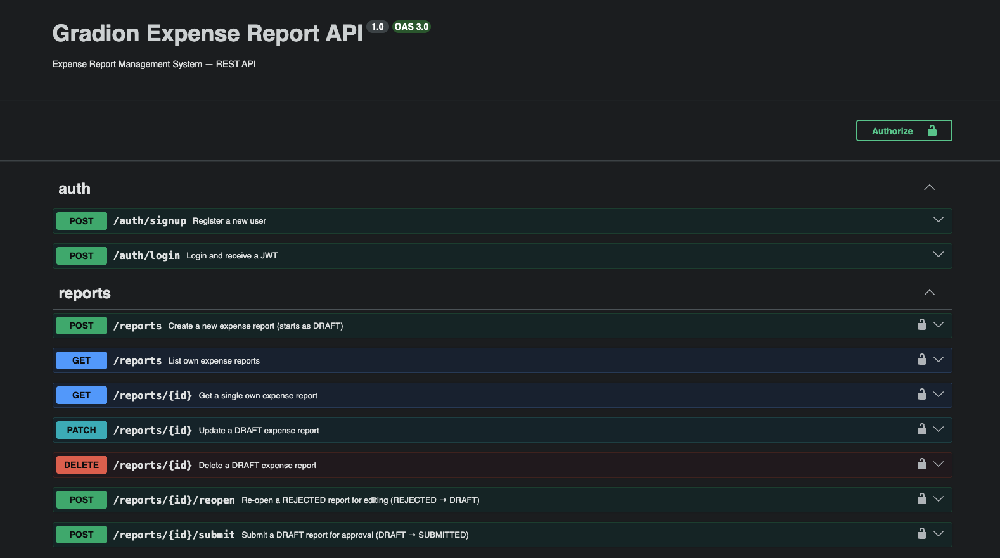

# Gradion Expense Report System

A full-stack Expense Report Management System built as a take-home assessment for Gradion.
Users create and submit expense reports with AI-powered receipt extraction.
Admins review, approve, or reject submitted reports with a full audit trail.

Stack: Next.js · NestJS · MongoDB · MinIO · Claude Vision API

**[Watch the demo video →](https://drive.google.com/drive/folders/11BiE17NYLTHqXpr3vYtUuBpImimYKY-1?usp=sharing)**

---

## Prerequisites

| Tool | Version |
|---|---|
| Node.js | 20+ |
| pnpm | 9+ |
| Docker + Docker Compose | any recent version |

Install pnpm if you don't have it: `npm install -g pnpm`

---

## Quick Start

```bash
# 1. Clone the repo
git clone <repo-url>
cd gradion-assessment

# 2. Set up backend environment
cp .env.example apps/backend/.env
# Open apps/backend/.env and fill in your ANTHROPIC_API_KEY
# All other values work as-is for local development

# 3. Set up frontend environment
echo "NEXT_PUBLIC_API_URL=http://localhost:3001" > apps/frontend/.env.local

# 4. Start infrastructure (MongoDB + MinIO)
pnpm dev:infra

# 5. Install dependencies
pnpm install

# 6. Start both apps
pnpm dev

# 7. Seed the admin account (run once, while the backend is running)
pnpm seed:admin
```

| Service | URL |
|---|---|
| Frontend | http://localhost:3000 |
| Backend API | http://localhost:3001 |
| Swagger UI | http://localhost:3001/api/docs |
| MinIO Console | http://localhost:9001 |

### Accounts

**Admin (seeded via script):**

| Email | Password |
|---|---|
| `admin@gradion.dev` | `Admin@1234` |

**User:** Register at http://localhost:3000/signup — the signup page creates user-role accounts only.

**MinIO Console** (http://localhost:9001):

| Username | Password |
|---|---|
| `minioadmin` | `minioadmin` |

> Admin account creation is intentionally not exposed in the UI. In a real system,
> privileged roles are provisioned through backend tooling or internal processes —
> not self-served through a public registration form. `pnpm seed:admin` simulates
> that boundary. To provision additional admin accounts, add entries to the `ADMINS`
> array in `apps/backend/src/scripts/seed-admin.ts` and re-run the script.
> It is idempotent — existing emails are skipped, new ones are created.

---

## Running Tests

```bash
# Unit tests
pnpm test

# End-to-end integration test (full DRAFT → SUBMITTED → APPROVED flow)
pnpm test:e2e
```

Unit tests cover service-layer logic (auth, report state transitions, item amount recomputation). The E2E test validates the full user lifecycle end-to-end: signup → create report → add items → submit → admin approve. All tests run entirely in-process using `mongodb-memory-server` — no Docker or running services required.

---

## Architecture

```
┌─────────────────────────────────────────────────────────────────┐
│                         Browser                                  │
│                                                                  │
│   ┌──────────────┐   ┌──────────────┐   ┌──────────────────┐   │
│   │  (auth)/     │   │   (user)/    │   │    (admin)/      │   │
│   │  login       │   │   reports    │   │  admin/reports   │   │
│   │  signup      │   │   items      │   │  approve/reject  │   │
│   └──────┬───────┘   └──────┬───────┘   └────────┬─────────┘   │
│          │   Next.js App Router — layout.tsx auth guards        │
└──────────┼──────────────────┼────────────────────┼─────────────┘
           │                  │ axios + JWT         │
           ▼                  ▼                     ▼
┌──────────────────────────────────────────────────────────────────┐
│                     NestJS API  :3001                            │
│                                                                  │
│  ┌──────────┐  ┌──────────┐  ┌───────────┐  ┌────────────────┐ │
│  │   Auth   │  │ Reports  │  │   Items   │  │     Admin      │ │
│  │ /signup  │  │ CRUD     │  │ CRUD      │  │ list/approve   │ │
│  │ /login   │  │ submit   │  │ DRAFT lock│  │ reject         │ │
│  │ JWT      │  │ reopen   │  │ totalAmt  │  │ statusHistory  │ │
│  └──────────┘  └──────────┘  └───────────┘  └────────────────┘ │
│                                                                  │
│  ┌──────────────────────────────────────────────────────────┐   │
│  │                      Uploads                             │   │
│  │  POST /items/:id/receipt → MinIO → Claude vision → item  │   │
│  └──────────────────────────────────────────────────────────┘   │
│                                                                  │
│  Global: JwtAuthGuard · RolesGuard · TransformInterceptor        │
│          HttpExceptionFilter · ValidationPipe                    │
└──────────┬───────────────────────────────┬───────────────────────┘
           │                               │
           ▼                               ▼
┌─────────────────────┐        ┌───────────────────────┐
│   MongoDB :27017    │        │     MinIO :9000        │
│   expense_reports   │        │   receipts/ bucket     │
│   expense_items     │        │   (public read)        │
│   users             │        └───────────┬────────────┘
└─────────────────────┘                    │
                                           ▼
                               ┌───────────────────────┐
                               │  Anthropic Claude API  │
                               │  vision extraction     │
                               │  { value, confidence } │
                               └───────────────────────┘
```

### Report Lifecycle

```
  User                          Admin
   │                              │
   │  POST /reports               │
   │  ──────────► DRAFT           │
   │                              │
   │  POST /reports/:id/submit    │
   │  ──────────► SUBMITTED ──────┤──► APPROVED  (terminal)
   │                              │
   │                              └──► REJECTED
   │                                      │
   │  POST /reports/:id/reopen ◄──────────┘
   │  ◄────────── DRAFT
   │  (edit, then submit again)
```

Every transition appends an immutable entry to `statusHistory` — actor, role, note, timestamp. The admin detail view renders the full timeline; users see a rejection note banner on their report.

### Module Boundaries

| Module | Responsibility | Rule enforced |
|---|---|---|
| `AuthModule` | JWT signup, login, token signing | Passwords never leave the service |
| `ReportsModule` | Report CRUD + state machine | All `status` mutations go through `assertTransition()` |
| `ItemsModule` | Item CRUD + `totalAmount` recomputation | All mutations require report in `DRAFT` |
| `UploadsModule` | MinIO storage + Claude extraction | Receipt URL saved before AI call; extraction failure never blocks upload |
| `AdminModule` | Cross-user report review | Ownership checks absent by design — admins see all |

---

## Project Structure

```
gradion-assessment/
├── apps/
│   ├── backend/          NestJS API (port 3001)
│   │   ├── src/
│   │   │   ├── auth/
│   │   │   ├── reports/  ← state machine lives here
│   │   │   ├── items/
│   │   │   ├── uploads/  ← MinIO + Claude extraction
│   │   │   ├── admin/
│   │   │   └── common/   ← guards, filters, interceptors, pipes
│   │   └── test/         ← e2e integration test
│   └── frontend/         Next.js App Router (port 3000)
│       ├── app/
│       │   ├── (auth)/   ← login, signup
│       │   ├── (user)/   ← report flow
│       │   └── (admin)/  ← admin console
│       └── components/
├── docs/
│   ├── architecture.md   Full architecture reference
│   └── plan.md           Phase-by-phase implementation plan
├── DECISIONS.md          Architectural decisions and trade-offs
├── CLAUDE.md             Claude Code project context (AI artifact)
├── docker-compose.yml
└── .env.example
```

---

## Known Limitations / Future Improvements

- **Async extraction** — receipt extraction currently runs synchronously in the upload request. A BullMQ + Redis queue (Phase 12) would decouple the Claude API call, preventing slow responses under load and enabling retries without user impact.
- **Pagination** — the report and item list endpoints return all records. At scale these need cursor- or offset-based pagination; the API surface already supports `?status=` filtering as a starting point.
- **File type validation** — receipt uploads accept images and PDFs but rely on MIME type from the client. Server-side magic-byte validation (e.g. via `file-type`) would be more robust.
- **Admin role provisioning** — admin accounts are seeded via a CLI script. A proper internal tool or IAM-backed provisioning flow would replace this in production.
- **Test coverage** — integration tests cover the happy path. Rejection/reopen flows, ownership boundary cases, and extraction failure paths warrant their own test cases.

---

## API Documentation

Swagger UI is available at **http://localhost:3001/api/docs** while the backend is running.
Click **Authorize** and paste a JWT from `POST /auth/login` to authenticate all requests.



---

## AI Usage

This project was built with [Claude Code](https://claude.ai/code) (Anthropic) as the primary development tool across all phases — backend modules, test suites, frontend UI, and documentation.

### How I used it

Rather than prompting for complete features, I structured the work as a controlled loop: write the specification first (in `CLAUDE.md` and `.claude/skills/`), generate an implementation, review it against the spec, correct it, then commit. The AI artifacts in the repo (`CLAUDE.md`, `docs/plan.md`, `docs/architecture.md`, `.claude/`) are the actual working context files used across sessions — not generated retrospectively for the submission.

### What the repo shows

- **`CLAUDE.md`** — the system spec I wrote before generating anything. Defines data shapes, module boundaries, state machine rules, API surface, and architectural constraints in one place. This file made multi-session work coherent; without it, each session would drift.
- **`DECISIONS.md`** — records *why*, not just *what*. Includes trade-offs I deliberately chose and alternatives I considered and rejected.
- **`.claude/skills/`** — structured prompts that encode project conventions so generated code conforms to them without re-explaining the design every session.
- **Commit history** — phases correspond to spec sections, not to when code happened to be ready. The structure of the history is intentional.

**What this demonstrates:** the value of AI tooling scales directly with how precisely you can specify what you want and how rigorously you review what you get.
